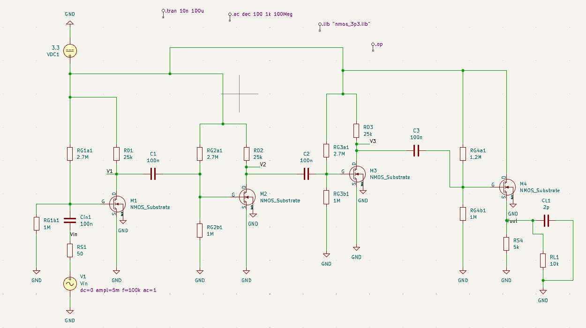
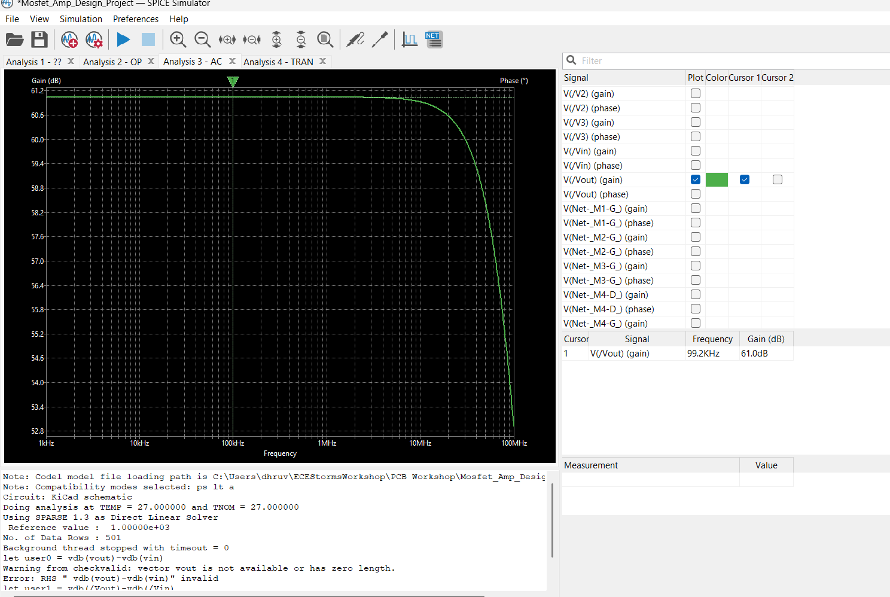
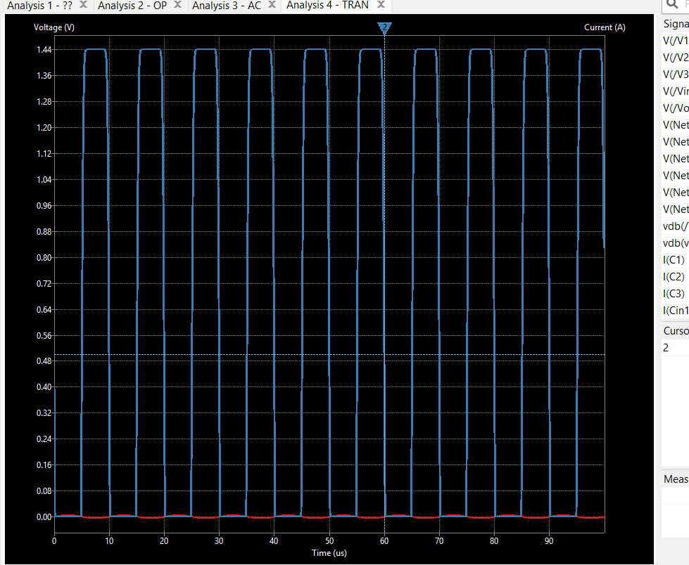

# Multistage High-Gain NMOS Voltage Amplifier

A 4-stage discrete NMOS small-signal amplifier designed and simulated in **KiCad (ngspice)**, operating from a single **3.3V DC rail**. The design balances high midband voltage gain with high input impedance and low output impedance to drive capacitive and resistive loads.

---

## Architecture & Topology

The amplifier utilizes a 4-stage architecture combining common-source gain blocks with a source-follower buffer:

* **Stages 1–3 (Common-Source Amplifiers):** 
  * Each CS stage utilizes a resistive voltage divider ($R_{G1} = 2.7\text{ M}\Omega$, $R_{G2} = 1\text{ M}\Omega$) setting the gate bias voltage ($V_G \approx 0.892\text{ V}$) to ensure operation in the saturation region.
  * $25\text{ k}\Omega$ drain resistors convert drain current variations into voltage amplification.
  * Inter-stage DC-blocking/AC-coupling capacitors ($100\text{ nF}$) isolate DC operating points while enabling AC signal propagation down to single-digit hertz cutoff frequencies.
* **Stage 4 (Common-Drain / Source Follower):**
  * Serves as an output buffer stage biased at $V_{G4} \approx 1.50\text{ V}$.
  * Provides low output impedance to drive a $10\text{ k}\Omega \parallel 2\text{ pF}$ load network with minimal voltage attenuation and loading loss.

```
+3.3V                 +3.3V                 +3.3V                 +3.3V
     |                     |                     |                     |
   [RD1]                 [RD2]                 [RD3]                   |
     |                     |                     |                   [M4] (CD Buffer)

Vin --[Cin]--[M1]--[C1]------[M2]--[C2]------[M3]--[C3]-------Gate         |
(CS Stage 1)          (CS Stage 2)          (CS Stage 3)           [RS4]--[CL || RL]-- GND
```

---

## Circuit Schematic



---

## Operating Characteristics & Results

| Parameter | Hand Calculation (1st Order) | SPICE Simulation Result | Unit |
| :--- | :--- | :--- | :--- |
| **Supply Voltage ($V_{DD}$)** | 3.30 | 3.30 | V |
| **Stage 1–3 Gate Bias ($V_G$)** | 0.892 | 0.892 | V |
| **Quiescent Drain Current ($I_{D1-3}$)**| 27.4 | 68.5 | µA |
| **Stage 4 Source Bias ($V_{S4}$)** | 0.395 | 0.395 | V |
| **Midband Voltage Gain** | 38.3 (~82 V/V) | **61.0 (~1122 V/V)** | dB |
| **-3 dB Cutoff Bandwidth** | — | **10 – 20** | MHz |
| **Peak-to-Peak Output Swing** | 1.50 | **1.44** | Vpp |
| **Input Resistance ($R_{in}$)** | 730 | 730 | kΩ |

---

## Simulation Waveforms

### 1. AC Frequency Response (Bode Magnitude Plot)
* **Midband Gain:** 61 dB (1122 V/V) measured at 100 kHz.
* **High-Frequency Roll-off:** Dominated by internal MOSFET parasitic capacitances ($C_{gs}, C_{gd}$) and inter-stage loading.



### 2. Transient Analysis (Output Voltage Swing)
* **Input Signal:** 100 kHz sinusoidal input.
* **Peak-to-Peak Output:** 1.44 Vpp clean signal swing before lower-rail ground clipping.



---

## Discrepancy & Second-Order Effects Analysis

The hand-calculated first-order voltage gain (~38.3 dB) differs from the simulated ngspice result (~61.0 dB):
1. **Simplified Square-Law Models:** Manual hand calculations assume ideal Level-1 MOSFET square-law behavior and ignore complex sub-threshold and velocity saturation modeling.
2. **Channel-Length Modulation ($\lambda$):** Small variations in effective output resistance ($r_o$) across three cascaded stages compound exponentially ($A_{v,\text{total}} \approx A_{v1} \times A_{v2} \times A_{v3} \times A_{v4}$).
3. **Biasing vs. Small-Signal Parameters:** Actual operating-point drain current under full SPICE models yielded higher effective transconductance ($g_m$) than conservative first-order hand estimates.

---

## Tools Used

* **EDA Suite:** KiCad Eeschema (Schematic Capture)
* **Simulation Engine:** ngspice (DC Operating Point, AC Sweep, Transient Analysis)
